# Les tours de Hanoï
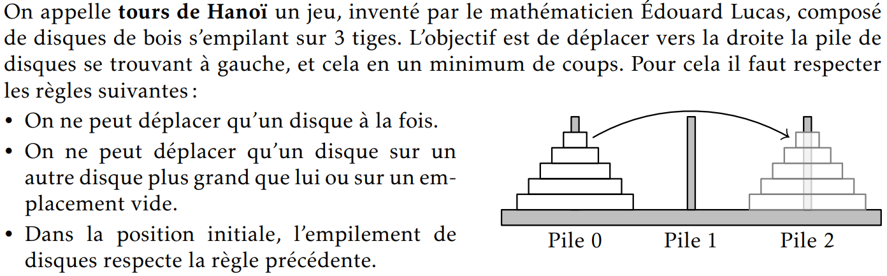
<!-- #### Rappels Pile/File -->
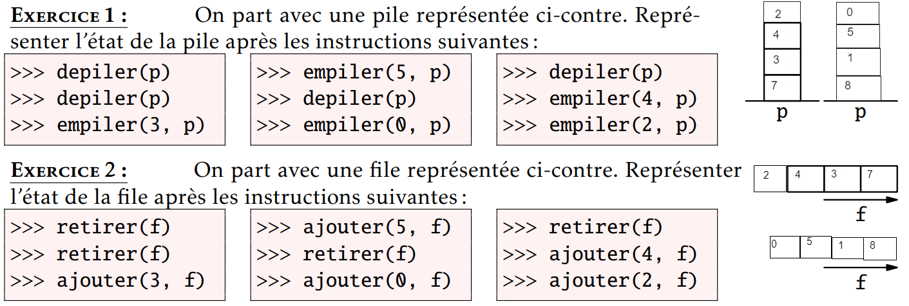
<!-- #### Schémas de principe -->
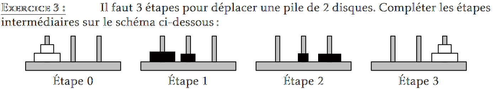
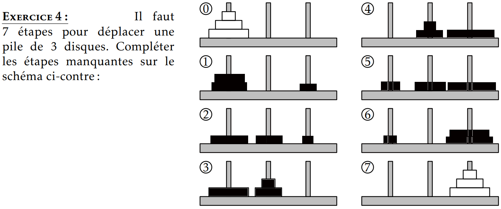

<div style="page-break-after: always;"></div>

## Programmation en Python

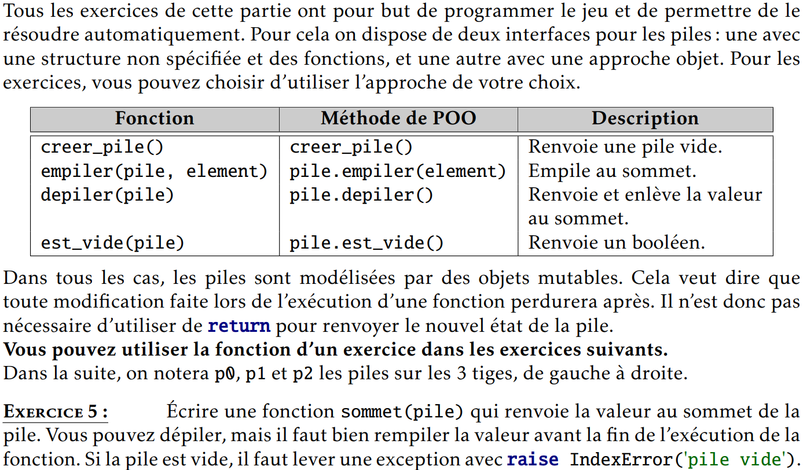

```python
def sommet(pile) :
    if est_vide(pile):
        raise IndexError("pile vide")
    else :
        sommet_valeur = depiler(pile)
        empiler(pile, sommet_valeur)
    return sommet-valeur


```
<div style="page-break-after: always;"></div>

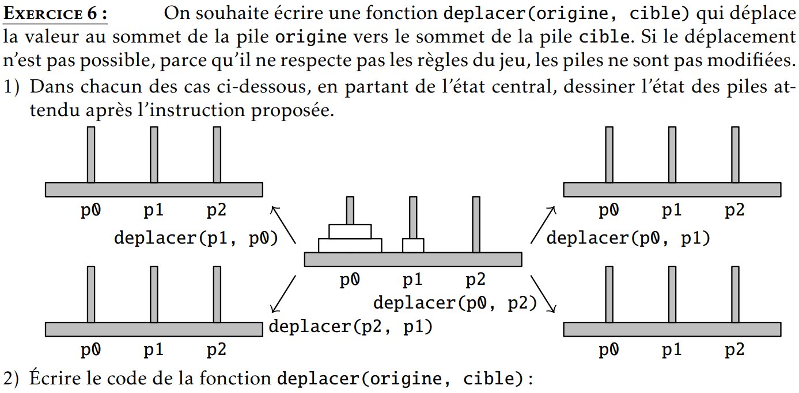

```python
def deplacer(origine, cible) :
    element = depiler(origine)
    empiler(cible, element)


```
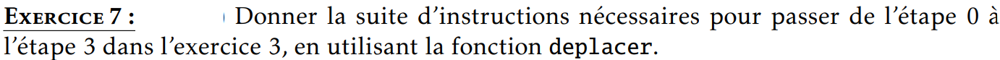

```python
deplacer(p0, p1)
deplacer(p0, p2)
deplacer(p1, p2)


```
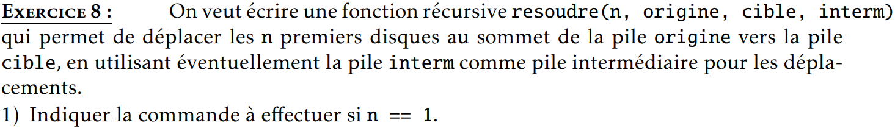

```python
deplacer(origine, cible)
```
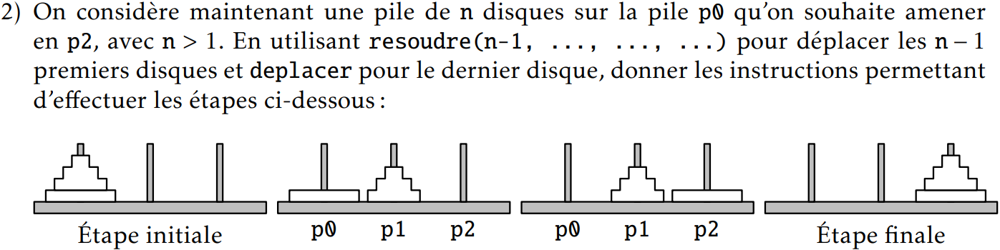

```python
resoudre(n-1, p0, p1)
deplacer(p0, p2)
resoudre(n-1, p1, p2)


```
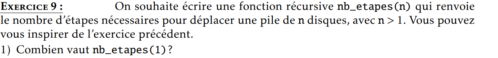
```
nb_etapes(1) = 1
```
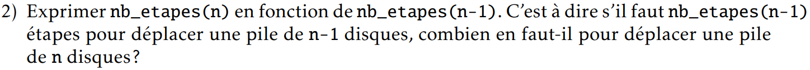
```
nb_etapes(n) = 2*(n-1)+1
```
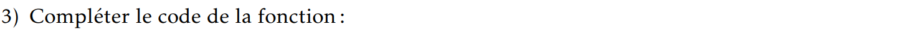
```python
def nb_etapes(n) :
    if n==1 :
        return 1 
    else : 
        return 2*nb_etapes(n-1)+1


```
